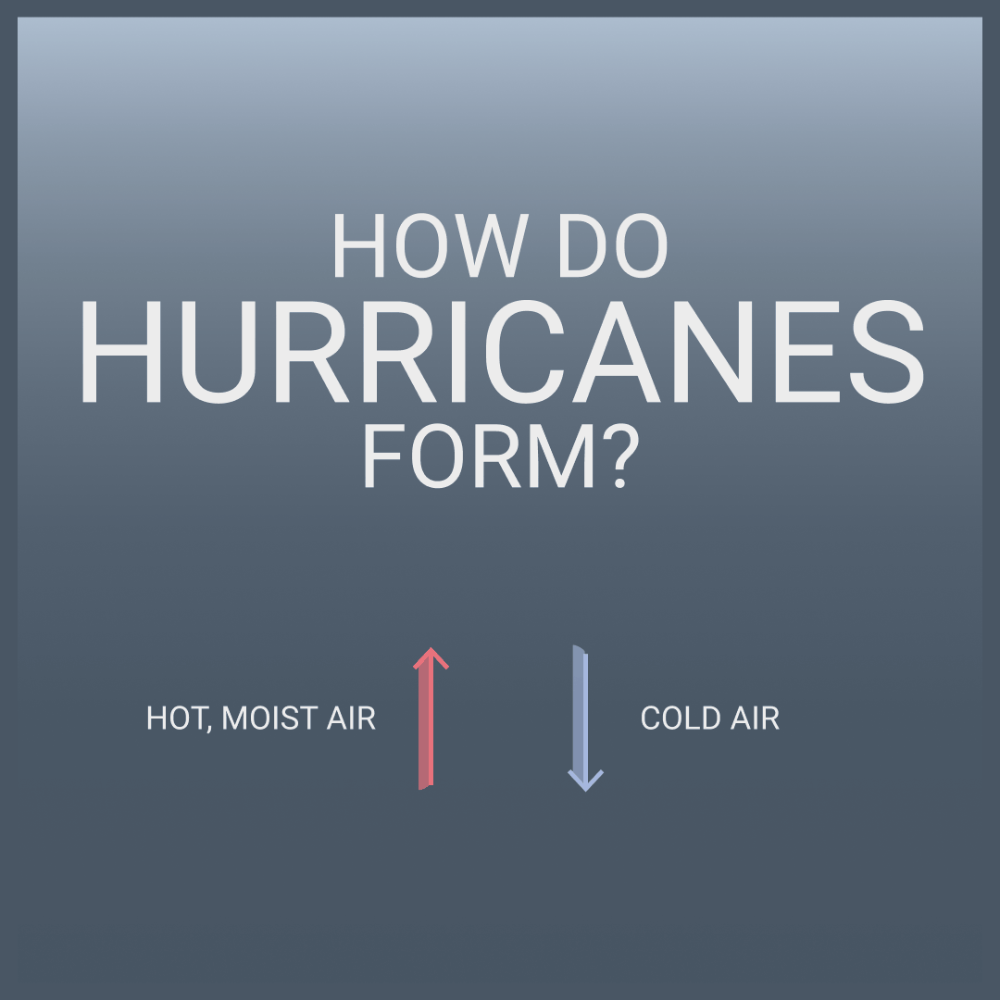

# Molly Cook-Escobar // BBC Application

<!--  
 -->
 
 <h2>1. Bring an example of what you think is the ‘best infographic’ you have ever seen.</h2>
 
 <a href="https://projects.fivethirtyeight.com/2016-election-forecast/">Five Thirty Eight's 2016 Election Forecast Dashboard</a> more accurately depicts the United States electoral college than conventional geographical representations do, which best visualized the uncertainty of the 2016 election better than most other forecasts.  

 

 <h2>2. Create a static or animated infographic that explains how hurricanes/cyclones work – design this for Instagram.</h2>
 
 <h3>Initial Sketch / Brainstorm</h2>

 

 <h3>Animated Instagram Graphic</h2>

 

